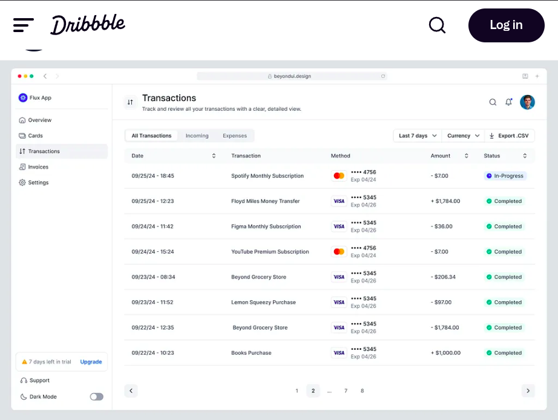
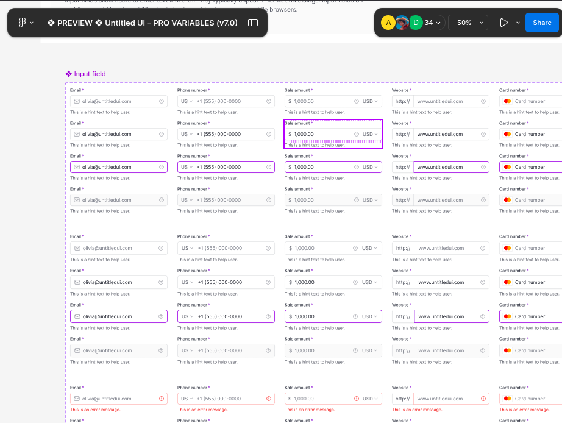

# Jurisphere Customer Dashboard

Backend implementation using FastAPI.

## Tech Stack

- FastAPI
- Python 3.8–3.11
- Uvicorn
- CORS Middleware

## Folder Structure

```
backend/
├── app/
│   ├── main.py          # FastAPI application and routes
│   └── data.py          # Mock customer data
├── requirements.txt     # Python dependencies
```

## Prerequisites

- Python 3.8 to 3.11
- pip (Python package manager)

## Setup Instructions

```bash
# Clone the repository and navigate to backend
git clone https://github.com/yourusername/jurisphere-dashboard.git
cd jurisphere-dashboard/backend

# Create and activate a virtual environment
python -m venv env

# Linux/macOS
source env/bin/activate

# Windows
.\env\Scriptsctivate

# Install dependencies
pip install -r requirements.txt
```

## Run the Server

```bash
uvicorn app.main:app --reload --port 8000
```

## API Endpoints

- `GET /customers` – Returns a list of mock customer objects

API Docs:
- Swagger: http://localhost:8000/docs
- ReDoc: http://localhost:8000/redoc

## Notes
- No environment variables are needed
- CORS is configured for `http://localhost:3000`

## Frontend Implementation

Built with **Next.js (App Router)**, **React**, **Tailwind CSS**, **TypeScript**, and **TanStack Query**.

### Folder Structure

```
frontend/
├── app/                      # App Router entry points
│   └── page.tsx              # Main dashboard page
├── components/
│   ├── common/               # Reusable UI components (Button, Modal, Tabs, etc.)
│   └── customers/            # Feature-specific components (Table, Details)
├── hooks/query
│   └── useCustomers.ts       # TanStack Query hook for fetching customer data
├── lib/api/customer
│   └── customer_api.ts                # API call abstraction
├── types/
│   └── customer.ts           # TypeScript interface for customer
├── public/                   # Static assets
├── next.config.js            # Next.js config
├── tailwind.config.js        # Tailwind configuration
├── tsconfig.json             # TypeScript configuration
└── .env                      # Environment variables
```

### Tech Stack

- **Next.js 14** (App Router)
- **React 18**
- **TypeScript**
- **Tailwind CSS**
- **TanStack Query v5**
- **Jest + React Testing Library** for unit testing

---

## Setup & Installation

### Prerequisites

- Node.js 18+
- npm or yarn

### Steps

```bash
# Navigate to frontend directory
cd frontend

# Install dependencies
npm install

# Start the development server
npm run dev
```

### Development Server

Once the server is running, the app will be available at:

```
http://localhost:3000
```

Ensure the backend is also running at `http://localhost:8000` for data fetching.

---

## UI Design Decisions

The visual design and layout of the dashboard were intentionally kept clean, consistent, and focused on usability.

### 🎨 Inspiration Sources

- **Dribbble UI Concepts**: Below are the designs which I took inspiration from.
    
- **Untitled UI (Figma)**: The input for Search has been inspired from Figma's Untitled UI.
    

### 🔍 Component Focus

- **Tabs**: Designed to resemble native navigation tabs found in modern SaaS dashboards.
- **Search Input**: Positioned with sufficient padding and used with debounce to avoid over-fetching.
- **Modal**: Mimics centered dialog behavior from professional UI kits — scroll-locking, escape key close, and outside-click detection implemented manually for control.
